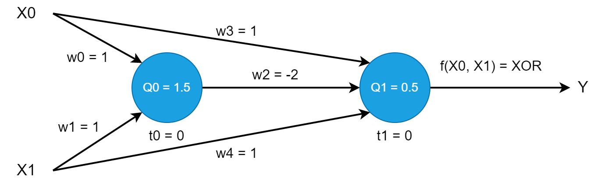

# Linear Regression, Neural Network and Clustering
# Linear Regression
## Data
| X | Y |
| :---: | :---: |
| 2 | 3 |
| 4 | 4 |
| 1 | 2.5 |
| 5 | 6 |
| 0 | 1 |
| 8 | 6 |
| 8.5 | 7 |
| 2 | 2 |
| 4.5 | 5.5 |
| 10 | 10 |

## Regression Coefficients
| X | Y | X<sup>2</sup> | Y<sup>2</sup> | XY |
| :---: | :---: | :---: | :---: |:---:|
| 2 | 3 | 4 | 9 | 6 |
| 4 | 4 | 16 | 16 | 16 |
| 1 | 2.5 | 1 | 6.25 | 2.5 |
| 5 | 6 | 25 | 36 | 30 |
| 0 | 1 | 0 | 1 | 0 |
| 8 | 6 | 64 | 36 | 48 |
| 8.5 | 7 | 72.25 | 49 | 59.5 |
| 2 | 2 | 4 | 4 | 4 |
| 4.5 | 5.5 | 20.25 | 30.25 | 24.75 |
| 10 | 10 | 100 | 100 | 100 |
| &Sigma; X = 45.0 | &Sigma; Y = 47.0 | &Sigma; X<sup>2</sup> = 306.5 | &Sigma; Y<sup>2</sup> = 287.5 | &Sigma; XY = 290.75 |

## Calculation Linear Regression Parameters
f(x) = w<sub>1</sub>x + w<sub>0</sub>

N = number of data
 
<div>
  <div class="w1" style="display: table-cell; vertical-align: middle;">w<sub>1</sub> = </div>
  <span class="Fraction" style="display: table-cell; text-align: center; padding: 0px 5px;">
    <span class="Numerator" style="padding: 0px 5px;">
    N &Sigma; x<sub>i</sub>y<sub>i</sub> - (&Sigma; x<sub>i</sub>)(&Sigma; y<sub>i</sub>)
    </span>
    <span class="Denominator" style="border-top: 1px solid; display: block; padding: 0px 5px;">
    N &Sigma; x<sub>i</sub><sup>2</sup> - (&Sigma; x<sub>i</sub>)<sup>2</sup>
    </span>
  </span>
</div>

<div>
  <div class="w0" style="display: table-cell; vertical-align: middle;">w<sub>0</sub> = </div>
  <span class="Fraction" style="display: table-cell; text-align: center; padding: 0px 5px;">
    <span class="Numerator" style="padding: 0px 5px;">1</span>
    <span class="Denominator" style="border-top: 1px solid; display: block; padding: 0px 5px;">N</span>
  </span>
  <div style="display: table-cell; vertical-align: middle;">(&Sigma; y<sub>i</sub>) - w<sub>1</sub> (&Sigma; x<sub>i</sub>)</div>
</div>

### Model
N = 10

w<sub>1</sub> = 0.76

w<sub>0</sub> = 1.27

f(x) = 0.76x + 1.27

## Error
| X | Y | Y<sub>pred</sub> | (Y<sub>i</sub> - Y<sub>pred</sub>)<sup>2</sup> |
| :---: | :---: | :---: | :---: |
| 2 | 3 | 2.79 | 0.04 |
| 4 | 4 | 4.32 | 0.10 |
| 1 | 2.5 | 2.03 | 0.22 |
| 5 | 6 | 5.08 | 0.84 |
| 0 | 1 | 1.27 | 0.07 |
| 8 | 6 | 7.37 | 1.87 |
| 8.5 | 7 | 7.75 | 0.56 |
| 2 | 2 | 2.79 | 0.63 |
| 4.5 | 5.5 | 4.70 | 0.64 |
| 10 | 10 | 8.89 | 1.23 |

ERROR = &Sigma; (Y<sub>i</sub> - Y<sub>pred</sub>)<sup>2</sup> = 6.21

## Code
``` python
import matplotlib.pyplot as plt

def format_float(num, formatted=True, digit=2):
    if formatted:
        return round(num, digit)
    else:
        return num

x = [2, 4, 1, 5, 0, 8, 8.5, 2, 4.5, 10]
y = [3, 4, 2.5, 6, 1, 6, 7, 2, 5.5, 10]
x2 = [i ** 2 for i in x]
y2 = [i ** 2 for i in y]
xy = [x * y for (x, y) in zip(x, y)]
sum_x = sum(x)
sum_y = sum(y)
sum_x2 = sum(x2)
sum_y2 = sum(y2)
sum_xy = sum(xy)
N = len(x)
w1 = (N * sum_xy - sum_x * sum_y) / (N * sum_x2 - sum_x ** 2)
w0 = (1 / N) * (sum_y - w1 * sum_x)
print("x:", x, "sum of x:", sum_x)
print("y:", y, "sum of y:", sum_y)
print("x^2:", x2, "sum of x^2:", sum_x2)
print("y^2:", y2, "sum of y^2:", sum_y2)
print("xy:", xy, "sum of xy:", sum_xy)
print("N:", N)
print("w1: (N * sum of xy - sum of x * sum of y) / (N * sum of x'2 - (sum of x)^2)")
print("w0: (1 / N) * (sum of y - w1 * sum of x)")
print("w1:", format_float(w1))
print("w0:", format_float(w0))
print("f(x) = w1x + w0")
print(f"f(x) = {format_float(w1)}x + {format_float(w0)}")

f = lambda a: w1 * a + w0
y_pred = [f(i) for i in x]
print("y_pred:", end=" ")
[print(format_float(i), end=", ") for i in y_pred]
print()
errors = [(yi - y_p) ** 2 for yi, y_p in zip(y, y_pred)]
print("errors:", end=" ")
[print(format_float(i), end=", ") for i in errors]
print()
error = sum(errors)
print("ERROR:", format_float(error))

plt.plot(x, y, 'ro')
plt.plot(x, y_pred)
plt.show()
```

## Result


# Neural Network
## Designing a Neural Network that Represents the XOR Function
### XOR Function
| X<sub>0</sub> | X<sub>1</sub> | Y |
| :---: | :---: | :---: |
| 0 | 0 | 0 |
| 0 | 1 | 1 |
| 1 | 0 | 1 |
| 1 | 1 | 0 |

### Neuron Design


Firstly, there are two conditions for the output to be 0, based on the sum of the inputs.

0 + 0 = 0 → 0

1 + 1 = 2 → 0

Otherwise, the output is 1.

1 + 0 = 1 → 1

0 + 1 = 1 → 1

So, two neurons are used for these conditions. In this case, w2 is important. Because, if inputs
are 1 and 1, w2 product -2, and it prevents passing activation function of the second neuron.

### Examples

X0 = 0

X1 = 0

Y = I ( X0 * w3 + X1 * w4 – 2 * ( I ( X0 * w0 + X1 * w1 – 0 > 1.5 ) ) – 0 > 0.5 )

Y = I ( 0 * 1 + 0 * 1 - 2 * ( I ( 0 * 1 + 0 * 1 – 0 > 1.5 ) ) – 0 > 0.5 ) = I ( 0 - 2 * I ( 0 > 1.5 ) > 0.5 ) = I (- 2 * 0 > 0.5 ) = 0

X0 = 1

X1 = 0

Y = I ( 1 * 1 + 0 * 1 - 2 * ( I ( 1 * 1 + 0 * 1 – 0 > 1.5 ) ) – 0 > 0.5 ) = I ( 1 - 2 * I ( 1 > 1.5 ) > 0.5 ) = I ( 1 - 2 * 0 > 0.5 ) = 1

X0 = 1

X1 = 1

Y = I ( 1 * 1 + 1 * 1 - 2 ( I ( 1 * 1 + 1 * 1 – 0 > 1.5 ) ) – 0 > 0.5) = I ( 2 - 2 * I ( 2 > 1.5 ) > 0.5 ) = I ( 2 - 2 * 1 > 0.5 ) = 0

# Clustering
I have data in data/points.txt. I made a few classifications on these data using the k means algorithm.

## Code
``` python
import seaborn as sns
import matplotlib.pyplot as plt
import pandas as pd
from sklearn.cluster import KMeans

class Point:
    def __init__(self, x: float, y: float):
        self.x = float(x)
        self.y = float(y)

    def __str__(self):
        return f"(x: {self.x}, y: {self.y})"

    def to_tuple(self):
        return self.x, self.y

    def __iter__(self):
        for i in self.__dict__.values():
            yield i

points = [tuple(Point(*line.strip().split('\t'))) for line in open("data/points.txt")]
print(points)

df = pd.DataFrame(points, columns=['x', 'y'])
k_means = KMeans(n_clusters=2, init='k-means++', random_state=0).fit(df)

sns.scatterplot(data=df, x="x", y="y", palette="tab10", hue=k_means.labels_, legend=False)
plt.scatter(k_means.cluster_centers_[:, 0], k_means.cluster_centers_[:, 1],
            marker="X", c="black", s=80, label="centroids")
plt.legend(loc=0, fontsize="small")
plt.show()
```

## Result
### K = 2


### K = 3


### K = 4


### K = 5


I think that the best result is K = 3. Because, As I see, A separation appears along the y-axis in
the range of 0.2 and 0.4 and in the range of 0.6 and 0.8 on the x-axis. It was the K = 3 cluster
algorithm that made this distinction best. Actually, If it is necessary to compare clusters
according to their centroids, K = 2 is very bad solution. The centroids of K = 2 are far from where
there is a lot of data. K = 3 is very good. K = 4 is maybe acceptable, but it is not good result for
orange cluster. K = 5 maybe acceptable, because locations of the centroids are not bad and they
are closed to a lot of data.
At the result, I think that the best result is K = 3 but, K = 5 maybe acceptable.


<span class="Fraction" style="display: table-cell; text-align: center; padding: 0px 5px;">
    <span class="Numerator" style="padding: 0px 5px;">1</span>
    <span class="Denominator" style="border-top: 1px solid; display: block; padding: 0px 5px;">2</span>
</span>